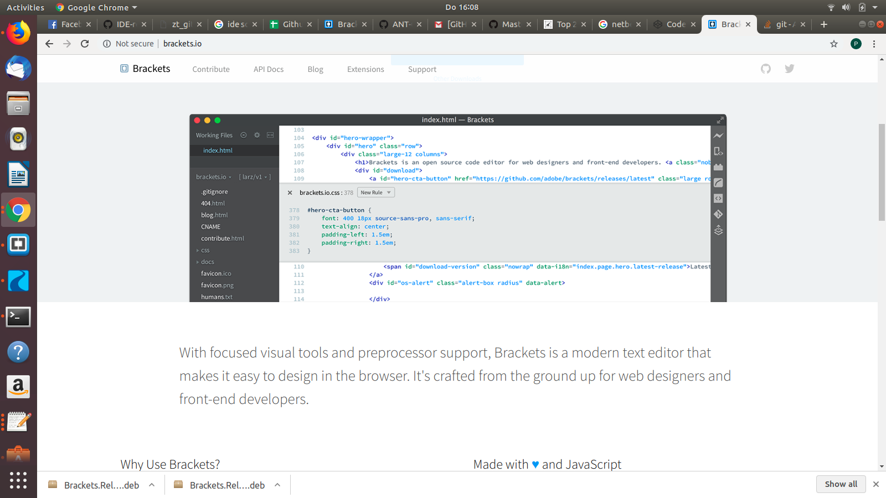

# Find and compare different editors 

### List of IDE's
- [x] Brackets :v:
- [ ] PHP storm 
- [ ] Codepen
- [ ] Netbeans 

## Chosen IDE : 
[BRACKETS](http://brackets.io/) :purple_heart: :blue_heart:

--- 

Made with ♥
> Brackets is a lightweight, yet powerful, modern text editor. We  blend visual tools into the editor so you get the right amount of  help when you want it without getting in the way of your creative process. You'll enjoy writing code in Brackets.

### 1. Pro's 
* It works on multiple platforms 
* FREE 
* Plug-in's 
* Preprocessor Support
* Inline editors

### 2. Con's 
* Doesn't support every languages such as : Xcode, Android JVM/NDK, Google Go, .. 
* Live preview is seperate 
* 

| **Brackets**  |                     |                |                |
| ------------- | ------------------- | -------------- | -------------- |  
| *Platforms*   |   Microsoft Windows |    Mac OS X    |     Linux      |
| *Language*    | C++, C, VBScript, Java, JavaScript, HTML, Python, Perl, Ruby |  

### No1 reason 

**Because Brackets is the best Code editor!!!**
( I used it before :grinning: )
  
  [Start to use!]( https://github.com/adobe/brackets/releases/download/release-1.13/Brackets.Release.1.13.64-bit.deb)
  
  
 

