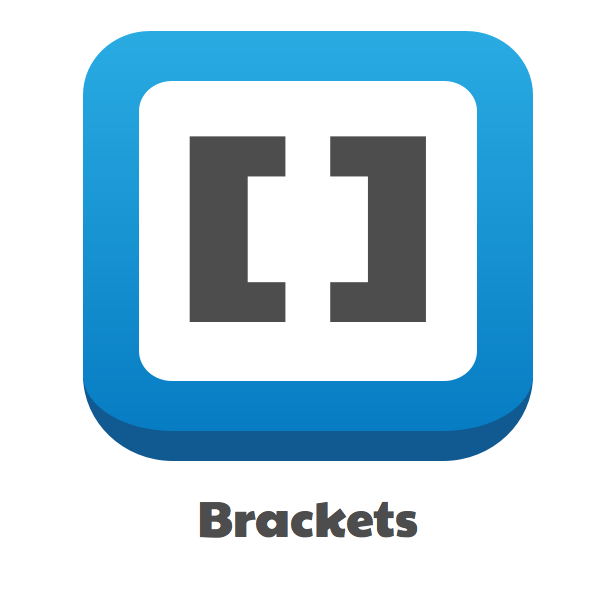

# Find and compare different editors 

### List of IDE's
- [x] Brackets :v:
- [ ] PHP storm 
- [ ] Codepen
- [ ] Netbeans 

**Chosen IDE : BRACKETS :purple_heart: :blue_heart:**

(link)

#### Pro's 
* It works on multiple platforms 
* FREE 
* Plug-in's 
* Preprocessor Support

#### Con's 
* Doesn't support every languages such as : Xcode, Android JVM/NDK, Google Go, .. 
* Live preview is seperate 
*

| **Brackets**  |                     |                |                |
| ------------- | ------------------- | -------------- | -------------- |  
| *Platforms*   |   Microsoft Windows |    Mac OS X    |     Linux      |
| *Language*    | C++, C, VBScript, Java, JavaScript, HTML, Python, Perl, Ruby |  

## 
